# Technical User Flow Documentation: Jawhart Plaza

This document outlines the technical user flow for the primary e-commerce journey in the **Jawhart Plaza** application, spanning from Cart Management to Order Tracking.

## 1. Authentication & Access

The entire checkout and order lifecycle is protected by the `auth` middleware. Guests must log in or register before they can:

- Add items to the Cart or Wishlist.
- Proceed to Checkout.
- Track Orders.

## 2. Cart Management (`CartController`)

- **Storage**: Items are stored in the database via the `Cart` model, linked to the authenticated user (`user_id`).
- **Data Structure**: A cart item consists of `product_id`, `product_variant_id`, and `quantity`.
- **Flow**:
    - The user adds items from the product listings or details page.
    - Cart modifications (update quantity, delete items, clear cart) are handled directly via API/Form calls routed to `CartController`.

## 3. Checkout Process (`CheckoutController`)

### Step 3.1: Initialization (`index` method)

- **Check**: Validates if the user's cart is empty. If empty, the user is redirected back to the cart page with an error.
- **Calculation**: Computes `subtotal` by iterating over cart items. Prioritizes variable pricing (Variant Price > Discount Price > Base Price).

### Step 3.2: Order Placement (`store` method)

- **Validation**: Strict server-side validation rules apply for billing details (Name, Phone, Address, Country, etc.) and `payment_method` (restricted to `cash` or `visa`).
- **Stock Assurance**: Iterates through cart items to ensure requested quantities do not exceed available `variant->stock`. If stock is insufficient, it aborts the process and redirects with an error message.
- **Database Transaction**:
    - `DB::beginTransaction()` is initiated to ensure atomic operations.
    - **Order Creation**: A new `Order` record is created with the calculated `total_amount`, serialised `shipping_address` (JSON), and an initial status of `pending`.
    - **Order Items**: Inserts multiple `OrderItem` records linking the order to specific products/variants, storing the exact price at the time of purchase.
    - **Stock Deduction**: Decrements inventory (`stock`) on the specific product variants.
    - **Cart Cleanup**: Clears all records from the `Cart` table for the current `user_id`.
    - `DB::commit()` saves the changes permanently. In case of any exception, `DB::rollBack()` prevents data corruption.
- **Routing Decision**:
    - If `payment_method` == `visa`: Redirects to the Payment Gateway route (`front.checkout.payment`).
    - If `payment_method` == `cash`: Redirects directly to the Order Success route (`front.checkout.success`).

## 4. Payment Gateway (`CheckoutController@payment`)

- **Route**: GET `/checkout/payment`
- **Current Behavior**: Renders a mockup payment UI (`payment.blade.php`) designed to collect Card Information (Card Number, Expiry, CVV).
- _Note for Backend Devs_: Currently, this page submits directly to the success page. Actual Payment Gateway Integration (e.g., Stripe, PayFort) will require adding a POST route to tokenize the card data and verify the transaction payload before updating order status and routing to `/checkout/success`.

## 5. Order Success (`CheckoutController@success`)

- **Route**: GET `/checkout/success`
- **Behavior**: Displays the confirmation UI (`success.blade.php`). Gives the user feedback that their order is being prepared and provides a primary call-to-action to navigate to the "Track My Order" page.

## 6. Order Tracking (`TrackOrderController`)

- **Route**: GET / POST `/track-order`
- **Tracking Flow**:
    - The user enters their `order_id`.
    - The controller queries the `Order` model along with eagerly-loaded relationships (`items.product`).
    - If the order doesn't exist, it redirects back with an error.
    - If found, it renders the `track-my-order` blade view, passing the `$order` object to display the current status, items, and tracking timeline.

---

### Sequence Diagram Summary

```mermaid
sequenceDiagram
    actor User
    participant Application
    participant Database

    User->>Application: View Cart & Click Checkout
    Application->>Database: Fetch Cart Items
    Database-->>Application: Return Items (calculates subtotal)
    Application-->>User: Render Checkout Form

    User->>Application: Submit Checkout Form (Details + Payment Method)
    Application->>Application: Validate Request & Stock

    rect rgb(0, 40, 0)
        Note right of Application: Start DB Transaction
        Application->>Database: Create Order (Status: Pending)
        Application->>Database: Create OrderItems
        Application->>Database: Decrement Variant Stock
        Application->>Database: Clear Cart Items
        Note right of Application: Commit DB Transaction
    end

    alt payment_method == "visa"
        Application-->>User: Redirect to /checkout/payment
        User->>Application: Submit Card Details
        Application-->>User: Redirect to /checkout/success
    else payment_method == "cash"
        Application-->>User: Redirect to /checkout/success
    end

    User->>Application: Enter Order ID in /track-order
    Application->>Database: Fetch Order & Items
    Database-->>Application: Return Order Details
    Application-->>User: Display Track Order View
```

